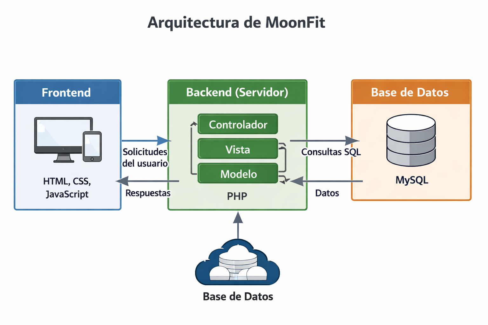

# Arquitectura
---

**Diagrama general** 

**Explicación técnica** 

La aplicación sigue una **arquitectura cliente-servidor** basada en **MVC (Modelo-Vista-Controlador)**:
- **Cliente (Frontend)**: Interfaz web que interactúa con el usuario.
- **Servidor (Backend)**: Gestiona la lógica de negocio, controla el acceso a la base de datos y responde a las peticiones del frontend.
- **Base de datos**: Almacena información de usuarios, entrenamientos y estadísticas.

**Tecnologías empleadas** 
 
| Capa           | Tecnología                |
|----------------|---------------------------|
| Frontend       | HTML, CSS, JavaScript     |
| Backend        | PHP                       |
| Base de datos  | MySQL                     |
