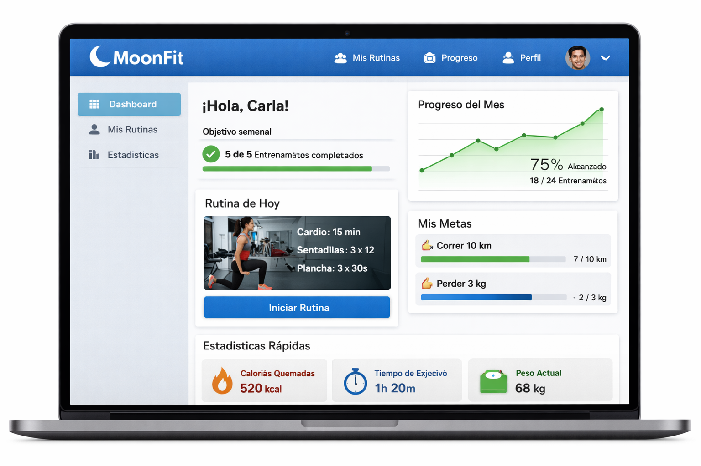

# Uso de la aplicación
---

## Usuarios tipo

**Usuarios particulares**
Personas que desean organizar y planificar sus entrenamientos, realizar un seguimiento de su actividad física y mejorar su condición física de manera autónoma.

**Entrenadores personales**
Profesionales del sector fitness que utilizan la aplicación para gestionar rutinas de entrenamiento y hacer seguimiento del progreso de varios usuarios.

**Centros deportivos o gimnasios**
Pequeños centros deportivos que necesitan una herramienta para organizar entrenamientos, clientes y rutinas de forma centralizada.

